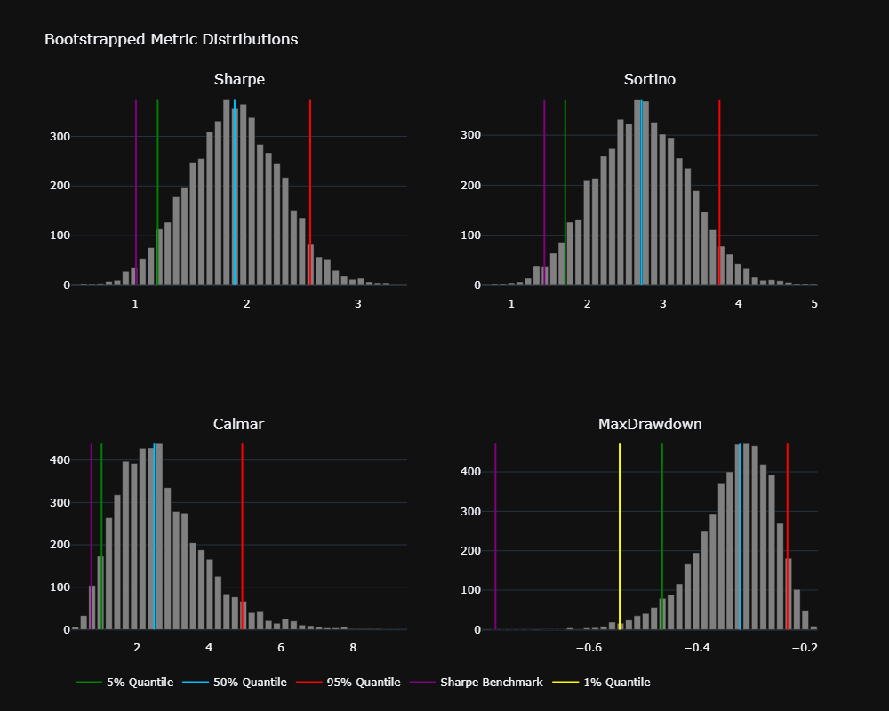

# QuantyBT 🪐

**A framework for quantitative backtesting and portfolio optimization, based on [vectorbt](https://github.com/polakowo/vectorbt). Focused on statistical robustness, modularity, and seamless integration of strategies, models, and crypto-native data loader.**  
---

## Current Models

### 🔹 Strategy Modules

- **Strategy**  
  Abstract base class for building custom trading strategies with modular signal and parameter structure.

- **Analyzer**  
  Simple `vectorbt`-based backtester. Outputs full performance metrics, equity curves, drawdown charts, and summary stats with minimal config.

- **AdvancedOptimizer**  
  The most comprehensive model in the project to date, a modified Walkforward Optimizer that supports both **rolling** and **anchored** validation schemes. It integrates **Bayesian Optimization** via [Hyperopt](https://github.com/hyperopt/hyperopt) for efficient hyperparameter search 
  Key enhancements include:    
    – A built-in **generalization loss penalty** to dynamically reduce overfitting  
    – Integrated **Monte Carlo bootstrapping** for each out-of-sample fold to assess robustness

- **Bootstrapping**  
  Monte Carlo simulation engine for risk estimation and statistical robustness.  
  Outputs full distribution metrics and p-values for Sharpe, Sortino, Calmar, Max Drawdown, and more.

- **LocalSensitivityAnalyzer**  
  Uses finite-difference-style perturbations to quickly screen for unstable or sensitive parameters.

- **GlobalSensitivityAnalyzer**  
  Performs full grid search across 2D parameter space for global insight into strategy behavior. 

- **Loader**  
  Integrated crypto data loader using [CCXT](https://github.com/ccxt/ccxt).  
  Fetches and saves Binance historical data, no API key required.

---

### 🔸 Portfolio Modules

- **CorrelationAnalyzer**  
   Calculates Pearson, Spearman, Kendall-Tau and **Copula-Tail-Dependence** correlations.

- **EqualWeightPortfolio**  
   Naive 1/n allocation model for aggregated strategy returns, ideal for small portfolios < 5 strategies. 
   Computes **CVaR** on global, rolling and empirical (via Bootstrapping) basis 

- **Hierarchical Risk Parity (Planned)**   
   allocation algorithm that clusters strategies based on statistical distance and recursively allocates risk to reduce overexposure to correlated groups

---

## Install
Local install recommended for custom changes
```bash
git clone https://github.com/papaya0712/quantybt.git
```

## Define ur strategy

```python
import pandas as pd
import numpy as np
from quantybt import Strategy
from typing import Dict, Any
from hyperopt import hp

class YourStrategy(Strategy):
    def preprocess_data(self, df: pd.DataFrame, params: Dict[str, Any]) -> pd.DataFrame:
        """Data preprocessing and feature engineering"""
        # Ensure proper datetime index
        if not isinstance(df.index, pd.DatetimeIndex):
            df['timestamp'] = pd.to_datetime(df['timestamp'])
            df = df.set_index('timestamp')
        
        # Calculate indicators/features
        df['feature1'] = df['close'].rolling(params['feature1_window']).mean()
        df['feature2'] = df['high'].rolling(params['feature2_window']).max()
        df['trendfilter'] = df['close'] > df['close'].rolling(params['trendfilter_len']).mean()
        
        # Generate signals (avoid lookahead bias)
        df['entries'] = np.where(
            (df['feature1'] > params['feature1_thresh']) & 
            (df['feature2'] > params['feature2_thresh']) & 
            df['trendfilter'],
            1, 0
        ).shift(1)  # Critical: shift to prevent lookahead
        
        # Optional: exit signals
        df['exits'] = np.where(
            df['close'] < df['close'].rolling(params['exit_window']).mean(), 1, 0).shift(1)
        
        return df.dropna()

    def generate_signals(self, df: pd.DataFrame, **params) -> Dict[str, pd.Series]:
        """Extract signals from preprocessed data"""
        return {
            'entries': df['entries'].astype(bool),
            'exits': df['exits'].astype(bool),
            # Optional for short trades:
            # 'short_entries': df['short_entries'].astype(bool),
            # 'short_exits': df['short_exits'].astype(bool)
        }

    @property
    def param_space(self) -> Dict[str, Any]:
        """Hyperparameter optimization space"""
        return {
            "feature1_window": hp.choice("feature1_window", [20, 50, 100]),
            "feature1_thresh": hp.uniform("feature1_thresh", 0.9, 1.1),
            "feature2_window": hp.choice("feature2_window", [5, 10, 20]),
            "feature2_thresh": hp.uniform("feature2_thresh", 0.95, 1.05),
            "trendfilter_len": hp.choice("trendfilter_len", [100, 200, 300]),
            "exit_window": hp.choice("exit_window", [5, 10, 20])
        }

params = {"feature1_window": 100, "sl_pct": 0.10, ...}
df = pd.read_feather("path/to/BTC_1d.feather")
df['timestamp'] = pd.to_datetime(df['timestamp'])
df = df.set_index('timestamp')

strat = YourStrategy()

```

---

## Simple Backtesting

```python
from quantybt import Analyzer

analyzer = Analyzer(
    strategy=strat,
    params=params,
    full_data=df,
    timeframe='15m',
    price_col="close",
    init_cash=1000,
    fees=0.0006,  # = 0.06% 
    slippage=0,
    trade_side='longonly',
    sl_stop=params['sl_pct']
)

print(analyzer.backtest_results())

analyzer.plot_backtest()
```

```text
Metric                                             Strategy   Benchmark

CAGR [%]                                              79.03     56.95
Total Return [%]                                    2497.84   1144.35
Max Drawdown [%]                                     -20.01    -77.27
Annualized Volatility [%]                              34.1     66.97
Sharpe Ratio                                           1.88      1.01
Sortino Ratio                                           2.7      1.43
Calmar Ratio                                           3.95       
Profit Factor                                          1.99       
Correlation to Benchmark                               0.51
--------------------------------           
Alpha [%]                                             64.79       
Beta                                                   0.26       
Kelly [%]                                             20.96       
Risk of Ruin_100, risk=kelly                            0.0       
Risk of Ruin_50,  risk=kelly                           0.01                                        
Total Trades                                            328       
Win Rate [%]                                          37.92       
Best Trade [%]                                        31.94       
Worst Trade [%]                                       -5.82       
Avg Winning Trade [%]                                  5.38       
Avg Losing Trade [%]                                  -1.47       
Avg Winning Trade Duration        3 days 12:48:30.483870967       
Avg Losing Trade Duration         1 days 08:28:53.497536945

```


---

## Montecarlo Simulation - Bootstrapping

### Quick Guide:
- **`analyzer`**: The already defined analyzer instance, as shown above. Alternatively, you can pass a return series `ret_series` and a timeframe `timeframe`.
- **`n_sims`**: Total number of simulations. Aim for at least 5,000 simulations; 10,000 is recommended.
- **`batch_size`**: Controls how many simulations run per batch to manage memory usage. With 32 GB of RAM, I typically use a batch size of 500–1,000.

Note: standard bootstrapping methods destroy the autocorrelation structure of ur return series

```python
from quantybt import Bootstrapping

mc = Bootstrapping(analyzer=analyzer, n_sims=10000, batch_size=500)

mc_results = mc.results()
print(mc_results)

```
```text
=== Empirical P-Value Tests (Simulated vs Benchmark) ===

            Sharpe: p-value = 0.03960 | benchmark = 1.0074 | sim_mean = 1.8808
           Sortino: p-value = 0.04080 | benchmark = 1.4347 | sim_mean = 2.7117
            Calmar: p-value = 0.03820 | benchmark = 0.7370 | sim_mean = 2.6505
       MaxDrawdown: p-value = 0.00040 | benchmark = -0.772 | sim_mean = -0.3299       
```

```python
fig = mc.plot_histograms(mc_results)
fig.show()

```


