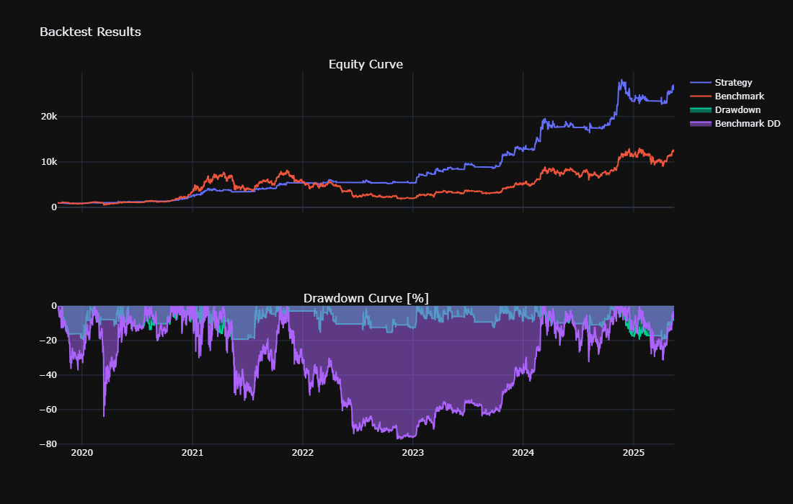
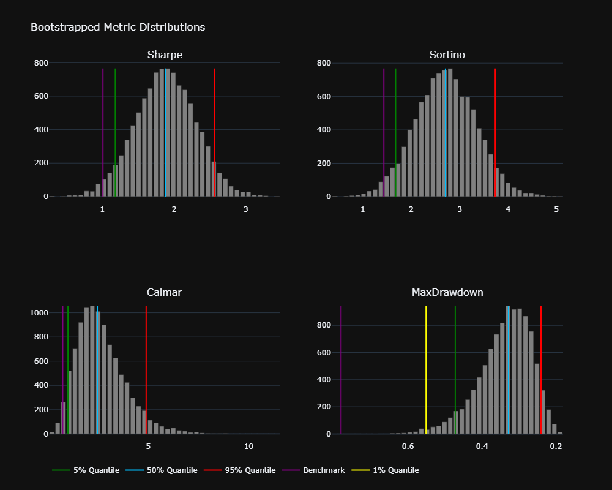

# QuantyBT 🪐

**A lightweight backtesting framework based on [vectorbt](https://github.com/polakowo/vectorbt), focused on statistical robustness, modularity, and seamless strategy integration with custom models and crypto-native data loading.**  
---

## Features

- **Simple integration** with vectorbt as the backtesting engine.
- **Custom Model Support**: Native wrappers for custom-implemented models (e.g., Kalman Filters) and statistical frameworks.  
- **Built-in data loaders** for cryptocurrencies from Binance (no api needed).
- **Modular architecture**: define strategies by inheriting from a base `Strategy` class (`preprocess`, `generate_signals`, `param_space`).
- **Robust Validation**: Out-of-sample splits and hyperparameter tuning via [Hyperopt](https://github.com/hyperopt/hyperopt).
- **Walkforward-Optimization**: with generalization loss function for dynamic overfitting control  
- **Statistical analysis tools**: Monte Carlo simulations
- **Parameter Sensitivity**: finite differences for local sensitivity (global incoming) 
- **Performance reporting**: generate equity curves, heatmaps, and metric summaries with minimal boilerplate.

---

## Incoming Features

- **More Custom Models**  
- **Portfolio Optimization** with advanced methods (HRP, CVaR, Maximum Entropy, ...)  
- **Live integration**
---

### Install
```bash
git clone https://github.com/papaya0712/quantybt.git
```

## Define ur strategy

```python
import pandas as pd
import numpy as np
from quantybt import Strategy
from typing import Dict, Any
from hyperopt import hp

class YourStrategy(Strategy):
    def preprocess_data(self, df: pd.DataFrame, params: Dict[str, Any]) -> pd.DataFrame:
        """Data preprocessing and feature engineering"""
        # Ensure proper datetime index
        if not isinstance(df.index, pd.DatetimeIndex):
            df['timestamp'] = pd.to_datetime(df['timestamp'])
            df = df.set_index('timestamp')
        
        # Calculate indicators/features
        df['feature1'] = df['close'].rolling(params['feature1_window']).mean()
        df['feature2'] = df['high'].rolling(params['feature2_window']).max()
        df['trendfilter'] = df['close'] > df['close'].rolling(params['trendfilter_len']).mean()
        
        # Generate signals (avoid lookahead bias)
        df['entries'] = np.where(
            (df['feature1'] > params['feature1_thresh']) & 
            (df['feature2'] > params['feature2_thresh']) & 
            df['trendfilter'],
            1, 0
        ).shift(1)  # Critical: shift to prevent lookahead
        
        # Optional: exit signals
        df['exits'] = np.where(
            df['close'] < df['close'].rolling(params['exit_window']).mean(), 1, 0).shift(1)
        
        return df.dropna()

    def generate_signals(self, df: pd.DataFrame, **params) -> Dict[str, pd.Series]:
        """Extract signals from preprocessed data"""
        return {
            'entries': df['entries'].astype(bool),
            'exits': df['exits'].astype(bool),
            # Optional for short trades:
            # 'short_entries': df['short_entries'].astype(bool),
            # 'short_exits': df['short_exits'].astype(bool)
        }

    @property
    def param_space(self) -> Dict[str, Any]:
        """Hyperparameter optimization space"""
        return {
            "feature1_window": hp.choice("feature1_window", [20, 50, 100]),
            "feature1_thresh": hp.uniform("feature1_thresh", 0.9, 1.1),
            "feature2_window": hp.choice("feature2_window", [5, 10, 20]),
            "feature2_thresh": hp.uniform("feature2_thresh", 0.95, 1.05),
            "trendfilter_len": hp.choice("trendfilter_len", [100, 200, 300]),
            "exit_window": hp.choice("exit_window", [5, 10, 20])
        }

params = {"feature1_window": 100, "sl_pct": 0.10, ...}
df = pd.read_feather("path/to/BTC_1d.feather")
df['timestamp'] = pd.to_datetime(df['timestamp'])
df = df.set_index('timestamp')

strat = YourStrategy()

```

---

## Simple Backtesting

```python
from quantybt import Analyzer

analyzer = Analyzer(
    strategy=strat,
    params=params,
    full_data=df,
    timeframe='15m',
    price_col="close",
    init_cash=1000,
    fees=0.0006,  # = 0.06% 
    slippage=0,
    trade_side='longonly',
    sl_stop=params['sl_pct']
)

print(analyzer.backtest_results())

analyzer.plot_backtest()
```


---

## Montecarlo Simulation - Bootstrapping

### Quick Guide:
- **`analyzer`**: The already defined analyzer instance, as shown above. Alternatively, you can pass a return series `ret_series` and a timeframe `timeframe`.
- **`n_sims`**: Total number of simulations. Aim for at least 5,000 simulations; 10,000 is recommended.
- **`batch_size`**: Controls how many simulations run per batch to manage memory usage. With 32 GB of RAM, I typically use a batch size of 500–1,000.

```python
from quantybt import Bootstrapping

mc = Bootstrapping(analyzer=analyzer, n_sims=10000, batch_size=500)

```

```text
=== Monte Carlo Simulation Summary ===
     CumulativeReturn    Sharpe   Sortino    Calmar  MaxDrawdown
std         32.322788  0.412371  0.614334  1.211303     0.074620
min          1.072135  0.550521  0.782023  0.247903    -0.700616
25%         14.237884  1.600357  2.290804  1.794304    -0.368881
50%         24.962024  1.875816  2.701299  2.491695    -0.317156
75%         42.779513  2.153406  3.127260  3.321080    -0.274771
max        369.369812  3.231397  4.778637  8.042642    -0.179398

=== Empirical P-Value Tests (Simulated vs Original) ===
  CumulativeReturn: p-value = 0.99700 | original = 24.9780 | sim_mean = 34.1293
            Sharpe: p-value = 0.99700 | original = 1.8784 | sim_mean = 1.8779
           Sortino: p-value = 0.99700 | original = 2.7030 | sim_mean = 2.7074
            Calmar: p-value = 0.28571 | original = 3.9488 | sim_mean = 2.6538
       MaxDrawdown: p-value = 0.01199 | original = -0.2001 | sim_mean = -0.3288

=== Empirical P-Value Tests (Simulated vs Benchmark) ===
  CumulativeReturn: p-value = 0.36963 | benchmark = 11.4435 | sim_mean = 34.1293
            Sharpe: p-value = 0.02597 | benchmark = 1.0074 | sim_mean = 1.8779
           Sortino: p-value = 0.02597 | benchmark = 1.4347 | sim_mean = 2.7074
            Calmar: p-value = 0.03596 | benchmark = 0.7370 | sim_mean = 2.6538
       MaxDrawdown: p-value = 0.00200 | benchmark = -0.7727 | sim_mean = -0.3288


```


